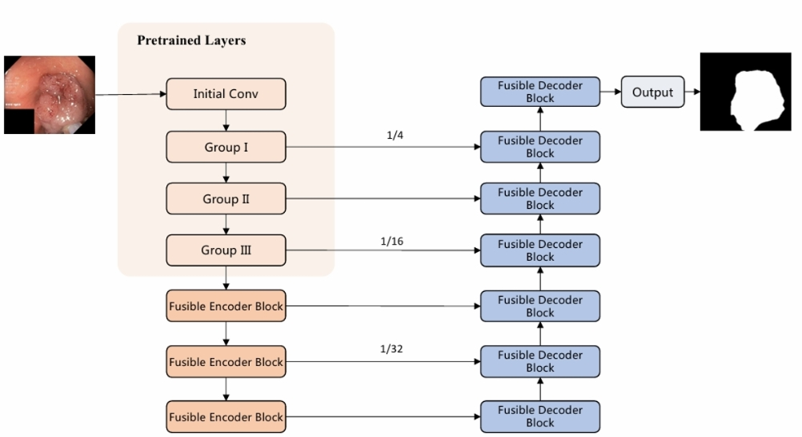

# LLM-TransUNet
Official Pytorch implementation of the paper [LV-UNet: A Lightweight and Vanilla Model for Medical Image Segmentation](https://arxiv.org/abs/2408.16886), which is published at IEEE BIBM2024 ML4BMI workshop.

## Architecture
<p align="center">

</p>


## Usage
### Data Format

Make sure to put the files as the following structure :

```
inputs
└── <dataset name>
    ├── images
    |   ├── 001.png
    │   ├── 002.png
    │   ├── 003.png
    │   ├── ...
    |
    └── masks
        ├── 001.png
        ├── 002.png
        ├── 003.png
        ├── ...
```

### Training and testing
#### Normal training and testing
1. Train the model.
```
python train.py --dataset <dataset name> --name <exp name> --img_ext .png --mask_ext .png --lr 0.001 --epochs 300 --input_w 256 --input_h 256 --b 8
```
2. Evaluate.
```
python val.py --name <exp name>
```

#### Deep training and testing in the deployment mode
1. Train the model.
```
python train.py --dataset <dataset name> --name <exp name> --img_ext .png --mask_ext .png --lr 0.001 --epochs 300 --input_w 256 --input_h 256 --b 8 --deep_training
```
2. Evaluate.
```
python val.py --name <exp name> --deploy
```

## Acknowledgements:

This code-base uses certain code-blocks and helper functions from [UNext]([https://github.com/4uiiurz1/pytorch-nested-unet](https://github.com/jeya-maria-jose/UNeXt-pytorch/)) and [VanillaNet]([https://github.com/NVlabs/SegFormer](https://github.com/huawei-noah/VanillaNet)).
```

## Citations

``` 
@misc{jiang2024lvunetlightweightvanillamodel,
      title={LV-UNet: A Lightweight and Vanilla Model for Medical Image Segmentation}, 
      author={Juntao Jiang and Mengmeng Wang and Huizhong Tian and Lingbo Cheng and Yong Liu},
      year={2024},
      eprint={2408.16886},
      archivePrefix={arXiv},
      primaryClass={eess.IV},
      url={https://arxiv.org/abs/2408.16886}, 
}
