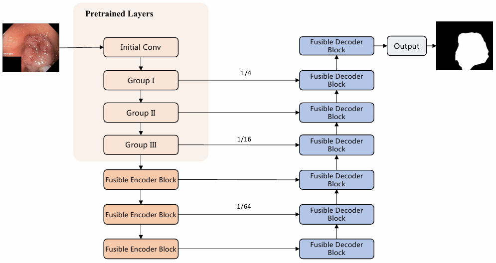

# LV-UNet
Official PyTorch implementation of the paper [LV-UNet: A Lightweight and Vanilla Model for Medical Image Segmentation](https://arxiv.org/abs/2408.16886), which is published at IEEE BIBM2024 ML4BMI workshop.

## Architecture
<p align="center">

</p>

## Update
[2025.8.14] The original code was unorganized and contained many errors. We have made corrections. We apologize for any inconvenience caused.

## Usage
### Data Format

Make sure to put the files as the following structure :

```
inputs
└── <dataset name>
    ├── images
    |   ├── 001.png
    │   ├── 002.png
    │   ├── 003.png
    │   ├── ...
    |
    └── masks
        ├── 001.png
        ├── 002.png
        ├── 003.png
        ├── ...
```

### Training and testing
#### Normal training and testing
1. Train the model.
```
python train.py --dataset <dataset name> --name <exp name> --img_ext .png --mask_ext .png --lr 0.001 --epochs 300 --input_w 256 --input_h 256 --b 8
```
2. Evaluate.
```
python test.py --name <exp name>
```

#### Deep training and testing in the deployment mode
1. Train the model.
```
python train.py --dataset <dataset name> --name <exp name> --img_ext .png --mask_ext .png --lr 0.001 --epochs 300 --input_w 256 --input_h 256 --b 8 --deep_training True
```
2. Evaluate.
```
python test.py --name <exp name> --deploy True
```

## Acknowledgements:

This code-base uses certain code-blocks and helper functions from [UNext](https://github.com/jeya-maria-jose/UNeXt-pytorch/) and [VanillaNet](https://github.com/huawei-noah/VanillaNet).

## Citations

``` 
@inproceedings{jiang2024lv,
  title={LV-UNet: A Lightweight and Vanilla Model for Medical Image Segmentation},
  author={Jiang, Juntao and Wang, Mengmeng and Tian, Huizhong and Cheng, Lingbo and Liu, Yong},
  booktitle={2024 IEEE International Conference on Bioinformatics and Biomedicine (BIBM)},
  pages={4240--4246},
  year={2024},
  organization={IEEE}
}
```
